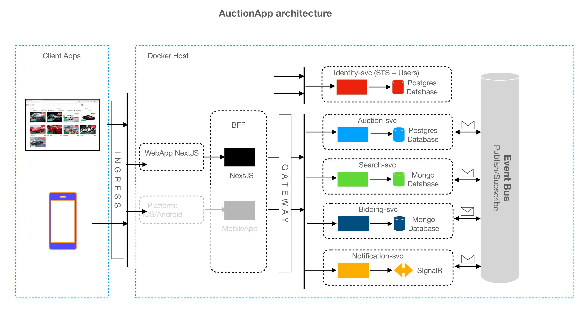

# AutoAuction Microservices – A .NET/C# Learning Project

A microservices-based auto auction platform built from scratch with .NET/C# for the backend and Next.js for the frontend. Users can register, upload profile pictures, place bids, and interact in real-time. The system integrates Docker, Kubernetes, RabbitMQ for event-driven communication, and Duende IdentityServer for authentication.

**Goals:**

- Deepen knowledge in microservices architecture

- Implement real-time bidding with message brokers

- Containerize with Docker and orchestrate with Kubernetes

- Future integration with Stripe for realistic payment flows

**Tech Stack:**

- Backend: .NET 8+, C#, Microservices, DDD

- Frontend: Next.js (React, TypeScript)

- Messaging: RabbitMQ

- Auth: Duende IdentityServer

- DevOps: Docker, Kubernetes

- Storage: SQL/NoSQL (TBD), Blob Storage for images

- Payments: Stripe (planned)

**Status:** Active development – Learning in progress
